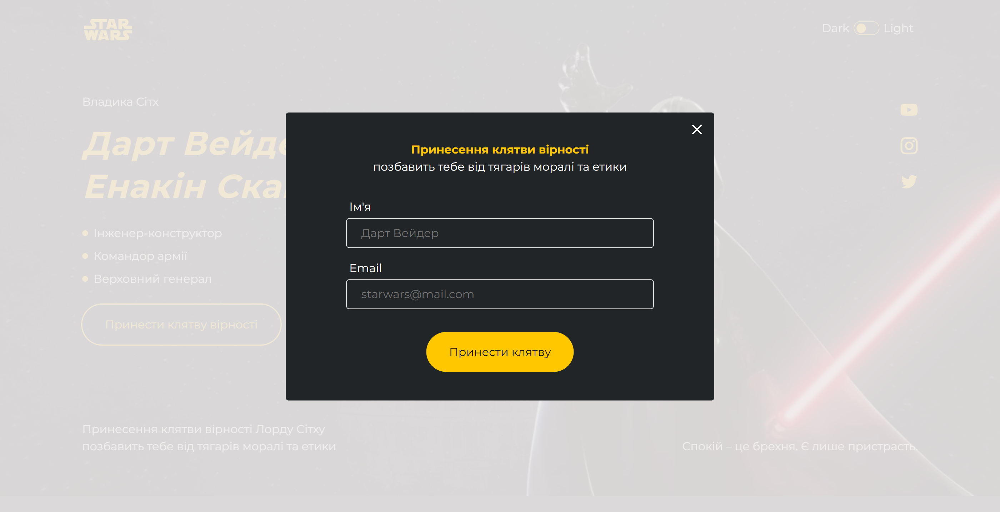
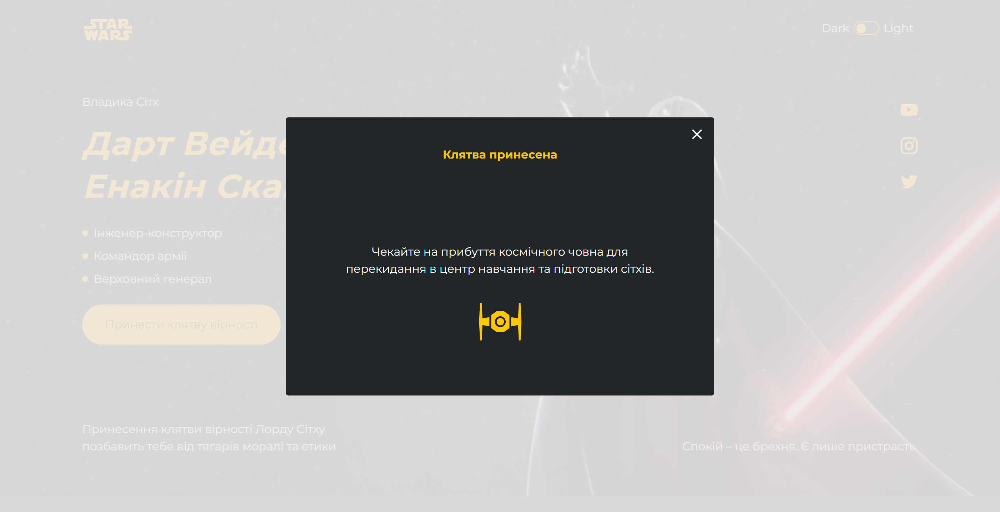
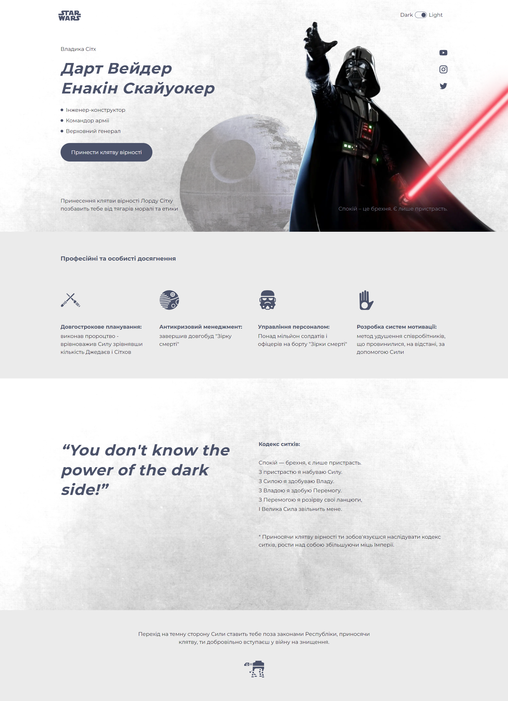
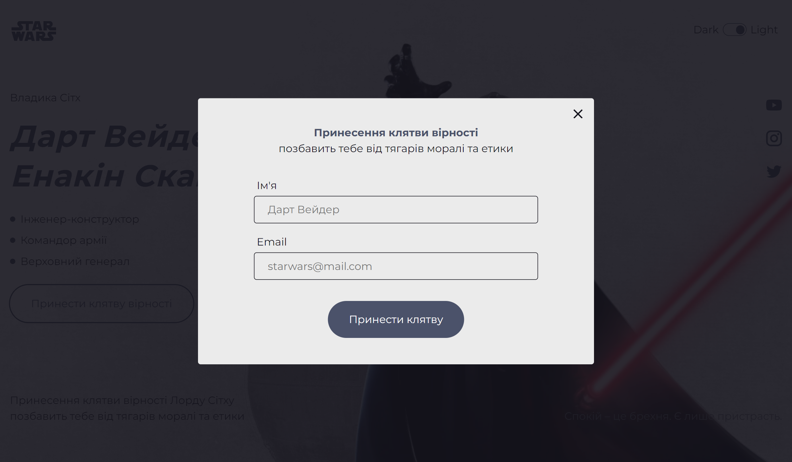
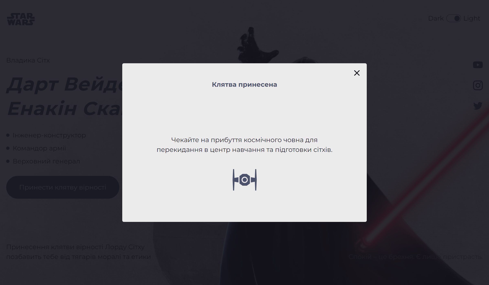

# Star Wars

###### Star Wars is a landing page about a Darth Vader and him codex.

## Table of Contents

- [Overview](#overview)
- [Features](#features)
- [Technologies Used](#technologies-used)
- [Demo](#demo)
- [Screenshots](#screenshots)
- [License](#license)
- [Contact](#connect-with-me)

## Overview

<image align="right" src="./src/images/logo.svg" alt="Logo" width="72"
height="32">

**Star Wars** Darth Vader is a character in the Star Wars franchise. He is the
primary antagonist of the original film trilogy and, as Anakin Skywalker, is the
protagonist of the prequel trilogy.

He has become one of the most iconic villains in popular culture, and his mask
is considered one of the most iconic character costume designs of all time.

The application includes a header, a main section with an “Order” button, and
sections with information about the Darth Vader. The footer contains Darth Vader
motto, be careful.

## Features

- The application is deployed on the **Parcel** assembly
- Desktop, tablet, mobile - **adaptive layout**
- **BEM methodology**
- Using **Mobile First method**
- **SASS preprocessor**
- Changing dark theme to light

- Hero section with a "Order" CTA button
- Modal window with information for communication
- "Hero" section
- 'Achievements' section
- 'Codex' section
- Footer

## Technologies Used

## Demo

[Demo](https://sokolova88.github.io/star-wars/)

## Screenshots

 _Full page dark theme_
 _Modal submit page dark theme_
 _Modal success page dark theme_
 _Full page light theme_
 _Modal submit page light theme_
 _Modal success page light theme_

## Issues

If you encounter any issues or have suggestions, please
[open an issue](https://github.com/Sokolova88/star-wars/issues).

## License

This project is licensed under the [MIT License](LICENSE).

## Feedback

I welcome feedback and suggestions from users to improve the application's
functionality and user experience.

## Languages and Tools:

## Connect with me:

